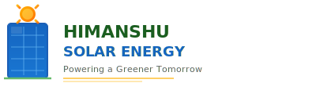
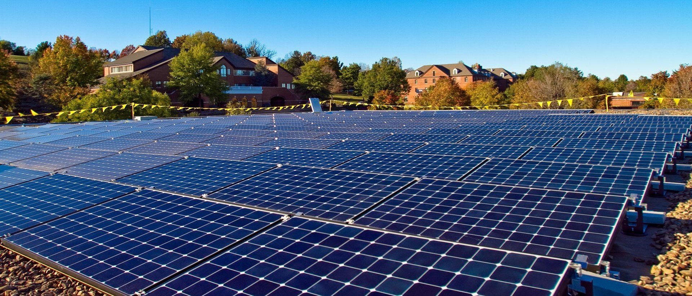

<div align="center">
  
  <h1>Himanshu Solar Energy</h1>
  <p><strong>Powering a Greener Tomorrow</strong></p>

  <p>
    <a href="https://github.com/vishwkarmasolar01-hash/solar/issues">
      
    </a>
    <a href="https://github.com/vishwkarmasolar01-hash/solar/network">
      
    </a>
    <a href="https://github.com/vishwkarmasolar01-hash/solar/stargazers">
      
    </a>
    
  </p>

  <p>
    <a href="https://vishwkarmasolar01-hash.github.io/solar/">
      
    </a>
  </p>
</div>

---

## About

**Himanshu Solar Energy** is a professional solar energy company based in **Panipat, Haryana** (near Pehalwan Chowk). We specialize in designing, installing, and maintaining high-quality solar power plants and energy systems for residential, commercial, and industrial clients.

This repository contains the company's official marketing website — a responsive, single-page application built with vanilla HTML, CSS, and JavaScript.



> **[View Live Site &rarr;](https://vishwkarmasolar01-hash.github.io/solar/)**

---

## Tech Stack

| Technology | Purpose |
|---|---|
| HTML5 | Semantic markup & accessibility |
| CSS3 | Responsive design, animations, gradients |
| Vanilla JavaScript | Splash screen, smooth scroll, counter animation, scroll-reveal, form handling |
| Font Awesome 6 | Icons |
| Google Fonts (Inter & Merriweather) | Typography |
| Formspree | Contact form backend |

---

## Features

- Animated splash screen with solar-themed branding
- Fixed navigation header with scroll-aware styling
- Smooth scroll navigation with fixed-header offset compensation
- Responsive design (mobile, tablet, desktop)
- Hamburger menu for mobile devices
- Scroll-reveal animations via IntersectionObserver
- Animated statistics counter
- Contact form with AJAX submission (Formspree ready)
- WhatsApp floating chat button
- SEO meta tags (Open Graph, Twitter Card)
- Accessibility best practices (ARIA labels, focus states, semantic HTML)

---

## Sections

| # | Section | Description |
|---|---------|-------------|
| 1 | **Splash** | Branded intro animation with logo and tagline |
| 2 | **Header** | Fixed navigation with active link tracking |
| 3 | **Hero** | Bold call-to-action with gradient background & visual |
| 4 | **About** | Company info, founder details & stats counter |
| 5 | **Services** | 6 service cards with hover effects |
| 6 | **Why Us** | 4 reasons to choose with numbered cards |
| 7 | **CTA Banner** | Call-to-action strip with gradient |
| 8 | **Contact** | Info details & AJAX contact form |
| 9 | **Footer** | Links, contact info, copyright |

---

## Getting Started

### Prerequisites

- A modern web browser (Chrome, Firefox, Safari, Edge)
- A text editor (VS Code recommended)
- (Optional) A [Formspree](https://formspree.io) account for the contact form

### Local Development

```bash
# Clone the repository
git clone https://github.com/vishwkarmasolar01-hash/solar.git

# Navigate into the project
cd solar

# Open in browser (or use Live Server in VS Code)
start index.html
```

No build tools or bundlers required — this is a pure static site.

---

## Deployment

### GitHub Pages
The site is already deployed at:
> **[https://vishwkarmasolar01-hash.github.io/solar/](https://vishwkarmasolar01-hash.github.io/solar/)**

To set up your own:
1. Go to repo **Settings** → **Pages**
2. Source: **Deploy from a branch**
3. Branch: `main`, folder: `/ (root)`
4. Save

### Netlify (Recommended)
1. Drag & drop the entire folder onto [Netlify Drop](https://app.netlify.com/drop)
2. Or connect your GitHub repo — set build command to empty and publish directory to `/`

---

---

## Configuration

### Contact Form
Replace the `action` URL in `index.html` (line 269) with your Formspree endpoint:

```html
<form class="contact-form" id="contactForm" action="https://formspree.io/f/YOUR_FORM_ID" method="POST">
```

### Images
Add your production images to `assets/images/`:

| File | Purpose | Recommended Size |
|---|---|---|
| `hero.webp` | Hero section (WebP) | ~100-300KB |
| `hero.jpg` | Hero section (JPEG fallback) | ~100-300KB |
| `og-image.jpg` | Social share preview | 1200x630 px |

### Business Info
Update company details — phone, email, address, WhatsApp, social links — in the **Contact** and **Footer** sections of `index.html`.

---

## File Structure

```
solar/
├── index.html          # Main HTML page
├── style.css           # All styles
├── script.js           # All JavaScript
├── README.md           # This file
├── assets/
│   ├── logo.svg        # Company logo
│   └── images/         # Add images here
│       ├── hero.webp
│       ├── hero.jpg
│       ├── background.jpg
│       ├── og-image.jpg
│       └── solar-pattern.svg
```

---

## Customization

### Colors
The site uses a blue + green palette with gold accents. Key CSS variables and gradients are in `style.css`:

```css
--primary: #FF8F00;       /* Gold accent */
--dark-blue: #0D47A1;     /* Hero/CTA background */
--dark-green: #1B5E20;    /* Section headers */
```

### Fonts
Two Google Fonts are used:
- **Playfair Display** — headings (serif, elegant)
- **Inter** — body & navigation (sans-serif, clean)

---

## License

This project is licensed under the MIT License.

---

## Contact

- **Phone**: [+91-8950269839](tel:+918950269839)
- **WhatsApp**: [+91-8950269839](https://wa.me/918950269839)
- **Email**: [vishvkarmasolar01@gmail.com](mailto:vishvkarmasolar01@gmail.com)
- **Instagram**: [@vishvkarmasolar](https://instagram.com/vishvkarmasolar)
- **Location**: Near Pehalwan Chowk, Panipat, Haryana (132103)

---

<div align="center">
  <sub>Built with ❤️ for a greener planet</sub>
  <br>
  <a href="https://vishwkarmasolar01-hash.github.io/solar/">Visit Live Site</a>
</div>
